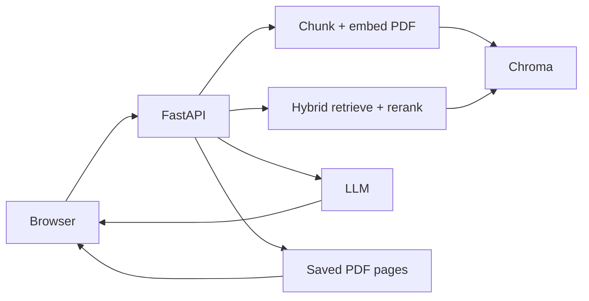

# 🤖 AI-Powered RAG Document Assistant

Ask questions about **your PDFs** and get short, grounded answers — then click a page chip to see the exact page.

React + FastAPI retrieval-augmented generation (RAG) app with Supabase auth, Chroma vectors, and OpenAI or Gemini.

---

## ✨ What it does

1. 📤 **Upload** a PDF  
2. 📌 **Select** that file (chat stays locked until you do)  
3. 💬 **Ask** a question — answers stay short and paraphrased  
4. 📄 **Open the page** — click `Page N · filename.pdf` to preview the source page  
5. 🗂️ **Keep history** — conversations are saved per user  

---

## 🧰 Stack

| Layer | Choice |
| --- | --- |
| 🖥️ Frontend | React, TypeScript, Vite, Tailwind CSS |
| ⚙️ Backend | Python 3.12, FastAPI, Uvicorn |
| 🔐 Auth / app data | Supabase Auth + Postgres (or local JSON for offline) |
| 🧠 Embeddings | `sentence-transformers/all-MiniLM-L6-v2` |
| 📚 Vectors | ChromaDB (on disk) |
| ✍️ LLM | OpenAI (`gpt-4o-mini`) or Gemini |
| 📑 PDF parse / preview | PyMuPDF |

---

## 🏗️ How RAG works



1. The PDF is parsed by page, chunked, embedded, and stored in Chroma.  
2. The original file is kept so page previews can be rendered.  
3. A question is retrieved with hybrid search, then the LLM answers **only from that evidence**.  
4. Retrieved text is treated as untrusted data, not as instructions.

---

## 🚀 Run locally

You need **two processes**: frontend on port `5173`, backend on port `8000`.

### 1. Backend

```bash
pip install -r backend/requirements.txt
copy .env.example backend\.env
```

Fill `backend/.env` (see [environment](#-environment-variables)). Then:

```bash
cd backend
uvicorn app.main:app --reload
```

Health check: [http://localhost:8000/health](http://localhost:8000/health)

> First start can take a minute while the embedding model loads. Later uploads are much faster.

### 2. Frontend

```bash
cd frontend
copy .env.example .env
npm install
npm run dev
```

App: [http://localhost:5173](http://localhost:5173)

### 3. Evaluation (optional)

```bash
python scripts/evaluate.py
```

Results: `evaluation/results/baseline.json`

---

## 🔑 Environment variables

### Backend (`backend/.env`)

| Variable | Purpose |
| --- | --- |
| `OPENAI_API_KEY` or `GEMINI_API_KEY` | LLM calls |
| `LLM_PROVIDER` | `openai` or `gemini` |
| `SUPABASE_URL` | Project URL (`https://xxxx.supabase.co`) — **not** `/rest/v1` |
| `SUPABASE_ANON_KEY` | Auth |
| `SUPABASE_SERVICE_ROLE_KEY` | Server-side document/conversation tables |
| `CORS_ORIGINS` | Frontend origin, e.g. `http://localhost:5173` |
| `AUTH_REQUIRED` | `false` locally; `true` in production |
| `EMBEDDING_MODEL` | Default MiniLM model is fine |

### Frontend (`frontend/.env`)

| Variable | Purpose |
| --- | --- |
| `VITE_API_BASE_URL` | Backend URL (`http://localhost:8000` locally) |
| `VITE_SUPABASE_URL` | Same project URL as the backend |
| `VITE_SUPABASE_ANON_KEY` | Browser auth only |

⚠️ **Never** put `SUPABASE_SERVICE_ROLE_KEY`, `OPENAI_API_KEY`, or `GEMINI_API_KEY` in any `VITE_` variable.

---

## 📡 API

| Method | Endpoint | Purpose |
| --- | --- | --- |
| `GET` | `/health` | Health check |
| `POST` | `/documents/upload` | Upload and index a PDF |
| `GET` | `/documents` | List documents |
| `DELETE` | `/documents/{id}` | Delete document, vectors, and stored file |
| `GET` | `/documents/{id}/pages/{n}` | PNG preview of page `n` |
| `POST` | `/retrieve` | Hybrid search |
| `POST` | `/chat` | Grounded answer |
| `POST` | `/chat/stream` | Stream the answer |
| `GET` | `/conversations` | List chats |
| `GET` | `/conversations/{id}` | Messages |
| `DELETE` | `/conversations/{id}` | Delete a chat |

---

## 🌐 Deploying (Vercel vs backend)

**Do not deploy the FastAPI backend on Vercel.** Deploy the **frontend** on Vercel and the **backend** somewhere that can run a long-lived Python process with disk.

| Piece | Put it on | Why |
| --- | --- | --- |
| 🖥️ React app | **Vercel** | Static Vite build. Perfect fit. |
| ⚙️ FastAPI + Chroma + PDFs | **Railway** | Always-on server, disk volume, enough time to embed PDFs. |

Vercel is built for frontends and short serverless functions. This backend is not that:

- PDF ingest and embeddings can take longer than a serverless timeout  
- Chroma and uploaded PDFs live on **disk** (`data/`)  
- The embedding model is large; cold starts would be slow and expensive  
- Chat streaming expects a normal HTTP server  

### Recommended production shape

```
Browser  →  Vercel (React)
                ↓  VITE_API_BASE_URL
         FastAPI on Railway
                ↓
         Chroma + PDFs on disk, LLM API, Supabase
```

1. Deploy the backend on Railway (see [`docs/deployment.md`](docs/deployment.md)).  
2. Attach a volume at `/data`.  
3. Deploy `frontend/` to Vercel with `VITE_API_BASE_URL` set to the Railway URL.  
4. Set Railway `CORS_ORIGINS` to the Vercel URL and `AUTH_REQUIRED=true`.  
5. Confirm `GET /health` on Railway, then try upload + chat from the live site.

More detail: [`docs/deployment.md`](docs/deployment.md).

---

## 🧪 Tests

```bash
cd backend
pytest
ruff check .
```

---

## 📁 Repo layout

```
frontend/     React dashboard
backend/      FastAPI, RAG pipeline, tests
supabase/     SQL schema
evaluation/   Retrieval dataset + metrics
docs/         Deployment notes
```

---

## 🛡️ Safety notes

- Answers are constrained to retrieved evidence; the model is told not to invent facts.  
- Evidence is treated as untrusted (prompt-injection resistant).  
- Service role and LLM keys stay on the server only.
